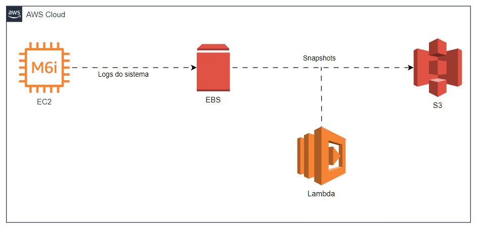

  <h1>🚀 Desafio AWS - Instâncias EC2</h1>

---

## Descrição

Esse desafio consiste na criação de um diagrama no draw.io com um caso de uso de nossa escolha, seguindo os ensinamentos e demonstrações vistas em aula.

Para concluir esse desafio passei pelas seguintes etapas:

1. Definição do caso de uso.
   - O objetivo do sistema é coletar, armazenar e manter registros de logs de uma aplicação crítica, garantindo rastreabilidade, auditoria e possibilidade de recuperação em caso de falhas.
2. Definição do escopo geral da solução utilizando serviços da AWS.

| Serviço | Função na Arquitetura |
|----------|----------------------|
| **EC2** | Instância principal responsável pelo processamento e armazenamento temporário dos logs. |
| **EBS** | Volume de armazenamento persistente anexado à EC2, garantindo durabilidade dos dados mesmo após reinicializações. |
| **Lambda** | Função serverless responsável por automatizar um backup diário do EBS para o S3. |
| **S3** | Armazena os snapshots gerados pelo AWS Lambda, oferecendo segurança, escalabilidade e alta durabilidade. |

3. Definição da 'familia' de instâncias EC2.
   - **Família escolhida**: General Purpose. Em geral as instancias dessa familia possuem equilíbrio entre CPU, memória e rede. Alem de que são compatíveis com diferentes tipos de storage e snapshots, facilitando backup e manutenção do sistema de logs.
4. Definição da instancia na familia escolhida, com base no seu proposito.
   - **Instância escolhida**: m6i.large (2 vCPUs, 8 GB RAM). Capacidade suficiente para processar e armazenar logs de um sistema de médio porte, possui um custo-benefício equilibrado e permite crescimento vertical ou horizontal futuro, caso o volume de logs aumente.
5. Montagem do diagrama com a representação do fluxo.

