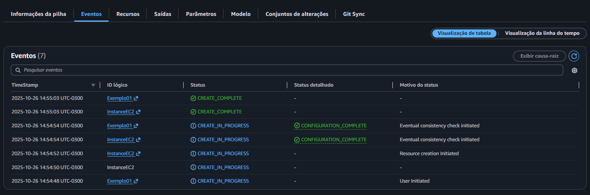
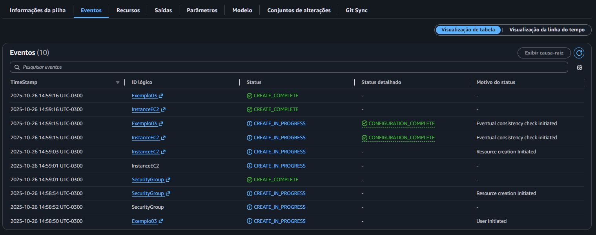
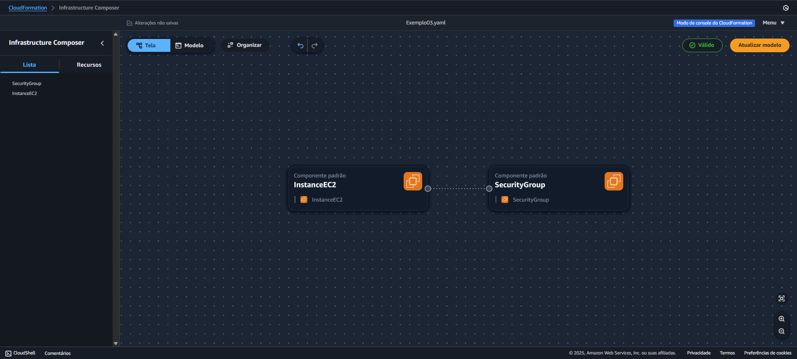
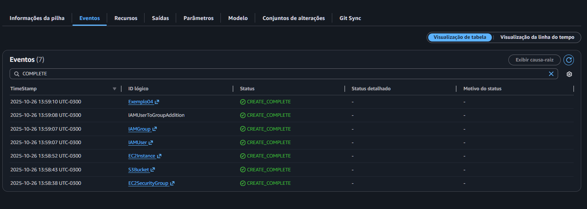
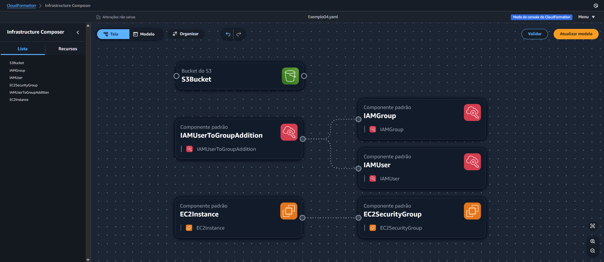

<div align="center">
  <h1>🚀 Desafio AWS CloudFormation</h1>
  <p>
    💡 Demonstrar conhecimento prático na criação e automação de recursos AWS por meio do <strong>CloudFormation</strong>.
  </p>
</div>

---

O **AWS CloudFormation** é um serviço que permite **provisionar e gerenciar recursos da AWS** de forma automatizada, utilizando **templates declarativos** nos formatos **YAML** ou **JSON**, possibilitando a implementação de Infraestrutura como Código (IaC).

Com ele, é possível:

- Criar e replicar rápidamente ambientes;
- Controlar versões de infraestruturas, permitindo rastreabilidade e consistência;
- Automatizar implantações complexas sem necessidade de configuração manual.

O CloudFormation **não possui custo adicional** pela utilização ou criação de templates, você paga apenas pelos recursos criados pelas stacks (como EC2, S3, IAM, etc.).

## Como funciona na pratica

O fluxo básico de uso do CloudFormation é:


1. Criação do template;
2. Executação no CloudFormation;
3. Resulta na stack criada.

Cada stack representa uma instância funcional do seu template, a stack pode ser criada, atualizada ou deletada com segurança, mantendo controle total sobre a infraestrutura.

### Referências Úteis

-> Documentação Oficial: [AWS CloudFormation Docs](https://docs.aws.amazon.com/cloudformation/)

-> Exemplos de modelos disponiveis em: [AWS Official Templates](https://github.com/aws-cloudformation/aws-cloudformation-templates)

-> **Você pode visualizar todos os modelos utilizados no diretório `/modelos`.**

---

# 🚀 Desafio

O desafio teve como foco **implementar stacks automatizadas** utilizando **AWS CloudFormation**, demonstrando domínio prático sobre a criação, configuração e interconexão de recursos na nuvem AWS.
Os exemplos foram **desenvolvidos de forma gradual**, partindo de uma simples instância EC2 até a criação de uma infraestrutura mais completa com EC2 + Security Group + IAM + S3.

---

## 📃 Modelos Criados

### 1. Criação de instância EC2 simples

Cria uma instância EC2 t3.micro básica na zona us-east-1a, com uma AMI padrão da AWS e tag de identificação.

```YAML
Description: Criar uma instancia EC2
Resources:
  EC2ByCloudFormation:
    Type: AWS::EC2::Instance
    Properties:
      AvailabilityZone: us-east-1a
      ImageId: ami-0ed9277fb7eb570c9
      InstanceType: t3.micro
      Tags:
        - Key: "Name"
          Value: "EC2"
```



### 2. EC2 com instalação automática do Apache

Inclui um script de inicialização (`UserData`) para instalar e iniciar o Apache automaticamente, disponibilizando uma página HTML simples com o hostname da instância.

```yaml
Description: Criar instancia EC2 e instalar Apache
Resources:
  InstanceEC2:
    Type: AWS::EC2::Instance
    Properties:
      AvailabilityZone: us-east-1a
      ImageId: ami-0ed9277fb7eb570c9
      InstanceType: t3.micro
      Tags:
        - Key: "Name"
          Value: "Webserver-Apache"
      UserData:
        Fn::Base64: !Sub |
          #!/bin/bash -xe
          yum install -y httpd.x86_64
          systemctl start httpd.service
          systemctl enable httpd.service
          echo "<h1>OLA AWS FOUNDATIONS do $(hostname -f)</h1>" > /var/www/html/index.html
```


### 3. EC2 + Apache + Security Group (Firewall)

Inclui a criação e associação de um Security Group, liberando acesso HTTP (porta 80).

```yaml
Description: Criar instancia EC2, instalar Apache e configurar firewall
Resources:
  InstanceEC2:
    Type: AWS::EC2::Instance
    Properties:
      AvailabilityZone: us-east-1a
      ImageId: ami-0ed9277fb7eb570c9
      InstanceType: t3.micro
      Tags:
        - Key: "Name"
          Value: "Webserver-Firewall"
      UserData:
        Fn::Base64: !Sub |
          #!/bin/bash -xe
          yum install -y httpd.x86_64
          systemctl start httpd.service
          systemctl enable httpd.service
          echo "<h1>OLA AWS FOUNDATIONS do $(hostname -f)</h1>" > /var/www/html/index.html
      SecurityGroups:
        - !Ref SecurityGroup

  SecurityGroup:
    Type: AWS::EC2::SecurityGroup
    Properties:
      GroupDescription: Acesso Liberado Porta 80
      SecurityGroupIngress:
        - IpProtocol: tcp
          FromPort: 80
          ToPort: 80
          CidrIp: 0.0.0.0/0
```





### 4. EC2 + IAM + S3 + Security Group (Firewall)

Este modelo cria uma stack completa contendo uma instância EC2, Security Group para acesso SSH, usuário IAM e grupo IAM com associação e um bucket S3 para armazenamento.

```yaml
AWSTemplateFormatVersion: "2010-09-09"
Description: Criar instancia EC2, configurar Security Group para acesso SSH, criar bucket S3, criar usuário e grupo IAM.
Parameters:
  InstanceType:
    Type: String
    Default: t3.micro
    Description: EC2 instance type
    AllowedValues:
      - t3.micro
      - t3.small
      - c7i-flex.large
      - m7i-flex.large
    ConstraintDescription: Deve ser um tipo de instância EC2 válido.

Resources:
  S3Bucket:
    Type: "AWS::S3::Bucket"
    Properties:
      BucketName: 3-bucket-s3-cloud-formation

  IAMGroup:
    Type: "AWS::IAM::Group"
    Properties:
      GroupName: GPO-ADMIN-CLOUD-FORMATION

  IAMUser:
    Type: "AWS::IAM::User"
    Properties:
      UserName: admin.cloud.formation

  IAMUserToGroupAddition:
    Type: "AWS::IAM::UserToGroupAddition"
    Properties:
      GroupName: !Ref IAMGroup
      Users:
        - !Ref IAMUser

  EC2Instance:
    Type: "AWS::EC2::Instance"
    Properties:
      InstanceType: !Ref InstanceType
      AvailabilityZone: us-east-1a
      ImageId: ami-0c2b8ca1dad447f8a
      KeyName: EC2_keys
      SecurityGroupIds:
        - !Ref EC2SecurityGroup
      UserData:
        Fn::Base64: !Sub |
          #!/bin/bash
          apt-get update
          apt-get install -y python3-pip

  EC2SecurityGroup:
    Type: "AWS::EC2::SecurityGroup"
    Properties:
      GroupDescription: Permitir acesso SSH
      VpcId: vpc-******************
      SecurityGroupIngress:
        - IpProtocol: tcp
          FromPort: "22"
          ToPort: "22"
          CidrIp: 0.0.0.0/0

Outputs:
  InstanceId:
    Description: ID da instância criada
    Value: !Ref EC2Instance

  InstancePublicIP:
    Description: IP público da instância
    Value: !GetAtt EC2Instance.PublicIp

  S3BucketName:
    Description: Nome do bucket S3 criado
    Value: !Ref S3Bucket

  IAMUserName:
    Description: Nome do usuário IAM criado
    Value: !Ref IAMUser
```





# Conclusão

O AWS CloudFormation simplifica e padroniza a criação de recursos na nuvem, reduzindo erros manuais e aumentando a escalabilidade das operações.

Durante este desafio, foi possível explorar desde o básico da orquestração de EC2 até a integração de múltiplos serviços, evidenciando o potencial da infraestrutura como código (IaC) na AWS.
