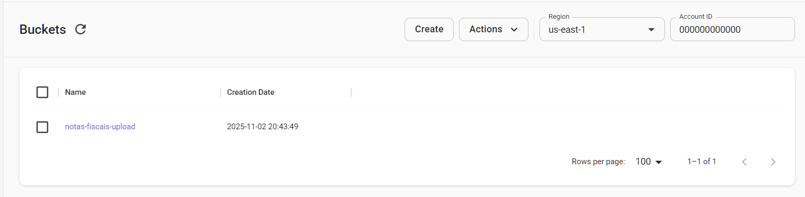
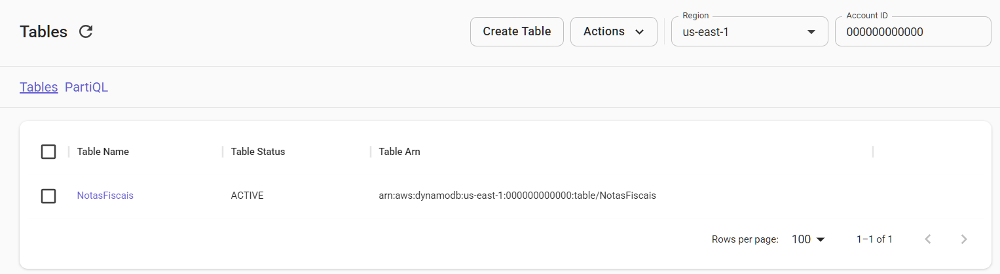
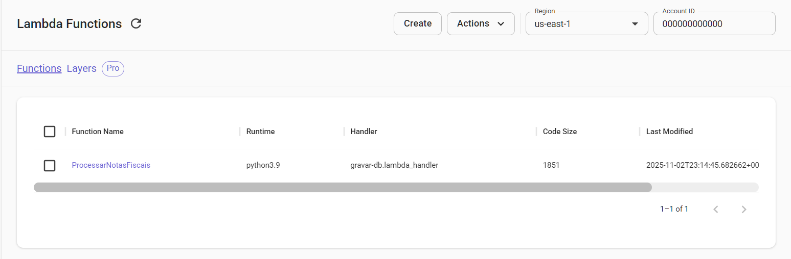

<div align="center">
  <h1>🚀 Desafio Tarefas automatizadas</h1>
  <strong> Utilizando AWS Lambda, DynamoDB e S3</strong>
  </p>
</div>

O desafio consiste em criar uma **arquitetura automatizada** que processa arquivos enviados para o **Amazon S3**, utilizando o **AWS Lambda** para orquestrar o fluxo e o **Amazon DynamoDB** como banco de dados para registro dos resultados.

## 🧰 Ambiente de Desenvolvimento

Para desenvolvimento e testes, foi utilizado o **[LocalStack](https://localstack.cloud/)**, uma ferramenta que simula os serviços da AWS localmente.  
Isso permite validar toda a arquitetura sem custos na nuvem, garantindo que:

- As funções Lambda funcionem corretamente;
- As interações com o S3 e DynamoDB ocorram como esperado;
- O fluxo completo seja testado antes da implantação real na AWS.

## ⚙️ Fluxo da Solução

1. **Upload de Arquivo:**  
   O usuário realiza o upload de um arquivo em um bucket S3.

2. **Trigger Lambda:**  
   Esse evento dispara automaticamente uma função **AWS Lambda** escrita em **python**.

3. **Processamento:**  
   A função Lambda processa o conteúdo do arquivo (por exemplo: leitura, limpeza ou transformação dos dados).

4. **Registro no DynamoDB:**  
   As informações processadas são gravadas em uma tabela do **Amazon DynamoDB**.

### 🪣 Criação do Bucket S3

Crie o bucket S3 no LocalStack:

```bash
awslocal s3api create-bucket --bucket notas-fiscais-upload
```

Para verificar se o bucket foi criado, execute:

```bash
awslocal s3api list-buckets
```



Realizar teste de upload de um arquivo para o bucket S3:

```bash
aws s3 cp notas_fiscais.json s3://notas-fiscais-upload --endpoint-url=http://localhost:4566
```

**Arquivo `notas_fiscais.json` está disponível no diretório do projeto.**

### 🗄️ Criação da Tabela no DynamoDB

Crie a tabela `NotasFiscais` no LocalStack:

```bash
aws dynamodb create-table \
  --endpoint-url=http://localhost:4566 \
  --table-name NotasFiscais \
  --attribute-definitions AttributeName=id,AttributeType=S \
  --key-schema AttributeName=id,KeyType=HASH \
  --provisioned-throughput ReadCapacityUnits=5,WriteCapacityUnits=5
```

Para verificar se a tabela foi criada, execute:

```bash
awslocal dynamodb list-tables
```



### ⚡ Criação Lambda Function

Crie a função Lambda `ProcessarNotasFiscais` no LocalStack:

```bash
aws lambda create-function --function-name ProcessarNotasFiscais --runtime python3.9 --role arn:aws:iam::000000000000:role/lambda-role --handler gravar-db.lambda_handler --zip-file fileb://lambda_function.zip --endpoint-
url=http://localhost:4566
```

Importante:
O comando aws lambda `create-function` exige o parâmetro `--zip-file` porque a AWS (e o LocalStack) esperam que o código seja empacotado antes do upload.

👉 Isso simula o comportamento real da AWS Lambda, onde o código precisa estar em um pacote `.zip`.

O arquivo `gravar-db.py` contém a função responsável por processar o conteúdo do arquivo recebido e gravar os registros na tabela NotasFiscais do DynamoDB.



Conceda permissão ao S3 para invocar a função Lambda:

```bash
aws lambda add-permission --function-name ProcessarNotasFiscais --statement-id s3-trigger-permission --action "lambda:InvokeFunction" --principal s3.amazonaws.com --source-arn "arn:aws:s3:::notas-fiscais-upload" --endpoint-url=http://localhost:4566
```

#### Configuração de Notificação do S3

Criação do arquivo `notificacao.json`, que será usado para configurar a notificação de eventos do S3:

```json
{
  "LambdaFunctionConfigurations": [
    {
      "Id": "s3-event-trigger-para-processar-notas",
      "LambdaFunctionArn": "arn:aws:lambda:us-east-1:000000000000:function:ProcessarNotasFiscais",
      "Events": ["s3:ObjectCreated:*"],
      "Filter": {
        "Key": {
          "FilterRules": [
            {
              "Name": "suffix",
              "Value": ".json"
            }
          ]
        }
      }
    }
  ]
}
```

Nela definimos a função lambda que vai ser invocada, os eventos que vai ser notificado e o filtro que vai ser usado para filtrar os eventos. Ou seja, o lambda vai ser chamado somente quando um arquivo com a extensão `.json` for criado no bucket `notas-fiscais-upload`.

Aplique a configuração no bucket:

```bash
aws s3api put-bucket-notification-configuration --bucket notas-fiscais-upload --notification-configuration file://notificacao.json --endpoint-url=http://localhost:4566
```

Validar a notificação no bucket S3:

```bash
aws s3api get-bucket-notification-configuration --bucket notas-fiscais-upload --endpoint-url=http://localhost:4566
```

## ✅ Resultado Esperado

Ao fazer o upload do arquivo `notas-fiscais.json` no bucket `notas-fiscais-upload`, o Lambda é chamado e os registros são inseridos na tabela `NotasFiscais` do DynamoDB.
