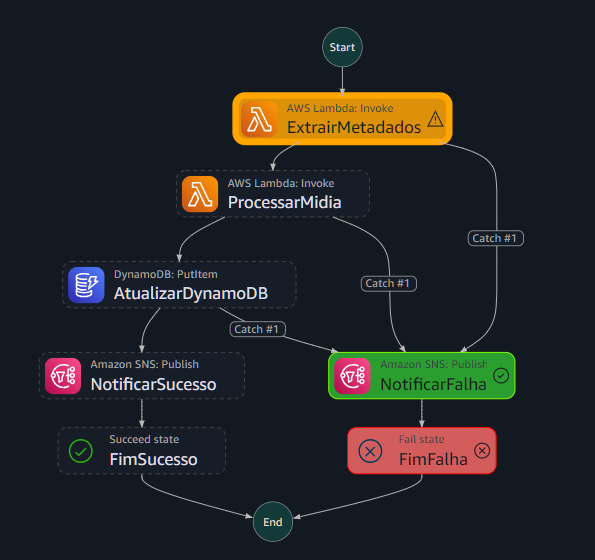

# 🚀 Desafio do módulo "Explorando Workflows Automatizados com AWS Step Functions"

## Descrição

Este projeto implementa um **workflow automatizado utilizando AWS Step Functions**, seguindo as práticas e demonstrações apresentadas durante o módulo do curso. 

---

## Caso de Uso

O objetivo é construir uma **pipeline de processamento de mídia totalmente automatizada**, integrando serviços AWS para processar arquivos, atualizar status e enviar notificações de sucesso ou falha.
O workflow representa uma pipeline de mídia, muito utilizado por empresas como **Netflix**, **Globo**, **Meta** e outras — para processar arquivos sob demanda (como vídeos e imagens).

Esse padrão é amplamente adotado pois oferece:

- **Separação de responsabilidades:** cada Lambda executa uma única etapa do processo;  
- **Tolerância a falhas embutida:** uso de *Retry* e *Catch* nas tasks;  
- **Passagem de contexto automatizada:** uso de variáveis `$.Payload` entre estados;  
- **Integração nativa com outros serviços AWS:** sem necessidade de código extra.

---

## Arquitetura

### Componentes e responsabilidades
- **S3**: armazena os arquivos de mídia e dispara evento para Step Functions ou publica para um EventBridge que inicia a execução.
- **Step Functions**: orquestra as etapas (extrair → processar → atualizar DB → notificar).
- **Lambda**: implementam a lógica de cada etapa (entrada/saída bem definidas).
- **DynamoDB**: armazena o status final e metadados do job.
- **SNS**: envia notificações de sucesso/falha para e-mail / outros sistemas.

### Definição da máquina de estados
StartAt: `ExtrairMetadados`

Estados principais:
- `ExtrairMetadados` (Task → Lambda)
- `ProcessarMidia` (Task → Lambda / MediaConvert)
- `AtualizarDynamoDB` (Task → DynamoDB PutItem)
- `NotificarSucesso` (Task → SNS Publish)
- `NotificarFalha` (Task → SNS Publish)
- `FimSucesso` (Succeed)
- `FimFalha` (Fail)

**Você pode visualizar o json completo do workflow no arquivo `workflow-streaming.json`.**

  

